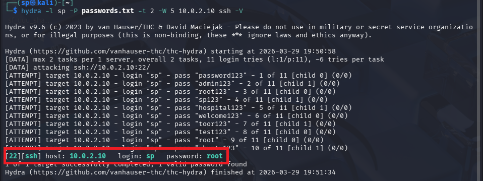
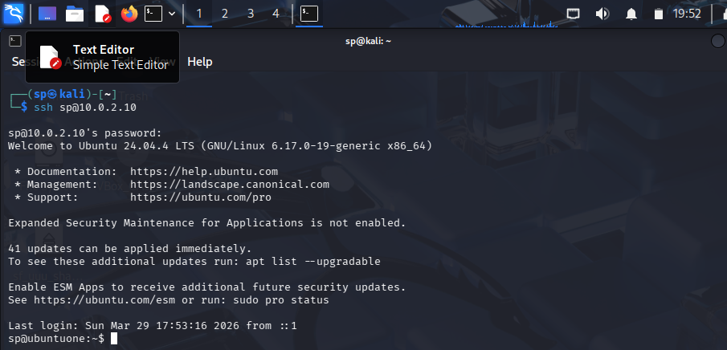
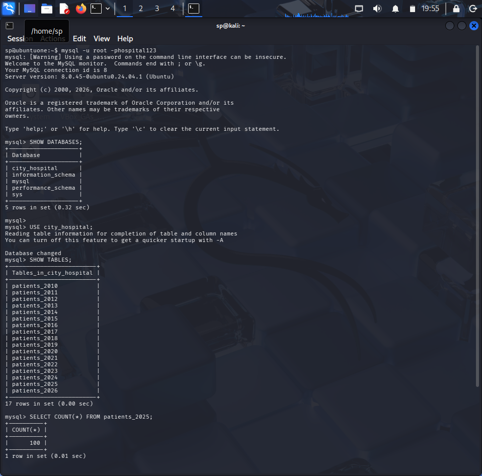
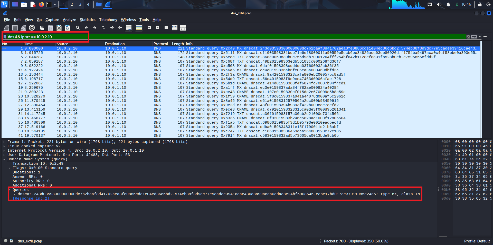
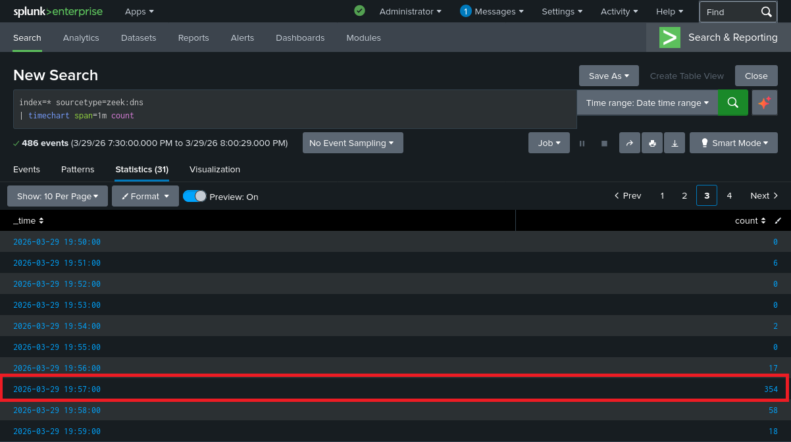
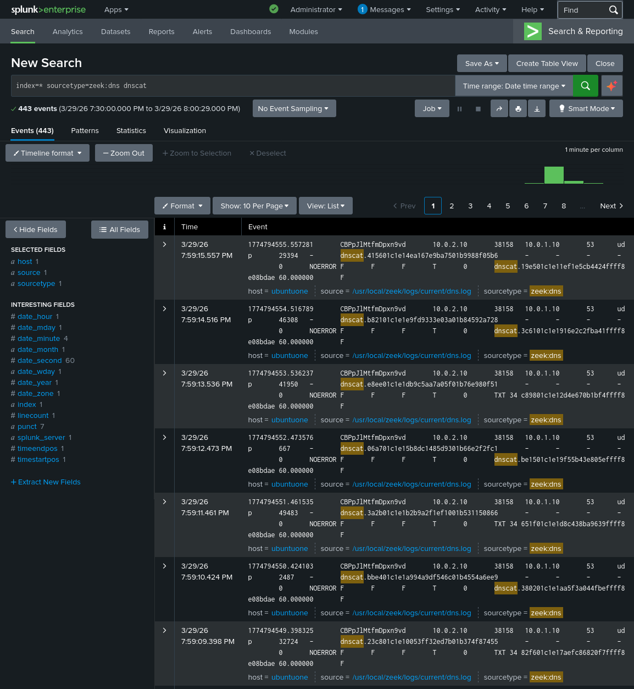

# Threat Hunting for Covert C2 DNS Tunneling and Data Exfiltration

This project demonstrates a hypothesis-driven threat hunt to detect covert data exfiltration over DNS in a controlled lab environment.

The investigation identifies how an attacker compromised an internal system, accessed structured data, and exfiltrated it using DNS tunneling without triggering any alerts. The hunt relies on baseline analysis, log correlation, and packet-level validation to uncover activity that traditional detection mechanisms failed to identify.

---

## Overview

A retrospective threat hunt was conducted on an internal Ubuntu server after identifying DNS as a potential blind spot in monitoring.

During analysis, a sequence of events was identified: a successful SSH login from an external host, followed by a short preparation phase where database records were accessed and extracted, and then a sudden spike in DNS activity. Within a 2-minute window, **3,948 DNS queries were generated**, carrying encoded data derived from the database. This represented a **316% increase above baseline behavior**, making it statistically anomalous.

No alerts were triggered at any stage. The activity was discovered only through structured threat hunting and correlation across multiple data sources.

---

## Lab Environment

| System | Role | Purpose |
|------|------|---------|
| Kali Linux | Attacker | Scanning, brute force, exfiltration |
| Ubuntu Server | Victim | Database host and compromised system |
| pfSense | Firewall / DNS | DNS resolution and traffic control |
| Zeek | Network Monitoring | DNS and network telemetry |
| Splunk | Log Analysis | Centralized investigation |

---

## Attack Scenario

The attacker initiated reconnaissance and identified an exposed SSH service on the Ubuntu server. A brute force attack was used to obtain valid credentials, resulting in successful system access.

After gaining access, the attacker located a configuration file containing plain-text database credentials. These credentials were used to connect to a MySQL database hosting structured patient records. The database contained multiple tables representing yearly data, and a total of **100 patient records were confirmed within a single dataset**.

The attacker then prepared the extracted data and established a covert communication channel using DNS tunneling. The dataset was encoded into DNS queries and transmitted to an attacker-controlled server. Because DNS traffic was trusted and allowed by the firewall, the activity blended with legitimate traffic and remained undetected.

---

## Hypothesis Statement

If an internal system is compromised and data is being exfiltrated through DNS tunneling, then DNS traffic will exhibit anomalies such as increased query volume, unusually long query strings, repeated patterns, and communication with uncommon domains.

These anomalies can be identified through baseline comparison and correlation with authentication activity.

---

## Threat Hunt Flow

```
Log Validation → Initial Access Detection → Session Establishment → DNS Spike Detection →
Exfiltration Detection → Volume Analysis → C2 Identification → Firewall Correlation → Packet Validation
```
---

## MITRE ATT&CK Mapping

| Tactic | Technique ID | Technique |
|------|---------------|----------|
| Reconnaissance | T1595 | Active Scanning |
| Initial Access | T1110.001 | Brute Force |
| Execution | T1059.004 | Unix Shell |
| Credential Access | T1552.001 | Unsecured Credentials |
| Collection | T1005 | Data from Local System |
| Command & Control | T1572 | Protocol Tunneling |
| Exfiltration | T1041 | Exfiltration Over C2 |

---

## Tools Used

| Tool | Purpose |
|------|--------|
| Splunk | Log analysis and correlation |
| Zeek | DNS traffic monitoring |
| pfSense | Firewall and DNS control |
| Wireshark | Packet-level validation |
| Nmap, Hydra, dnscat2 | Attack simulation |

---

## Screenshots

### 1. Initial Access

  
*Brute force attack used to obtain valid SSH credentials*

  
*Successful login confirms system compromise*

---

### 2. Data Access

  
*Access to structured database containing patient records (100 records identified)*

---

### 3. Exfiltration Mechanism

  
*High-volume DNS queries with long, encoded subdomains indicating tunneling-based data exfiltration*

### 4. Threat Hunting Detection

  
*Significant spike in DNS traffic following system compromise*

  
*Detection query identifying high-volume DNS requests with encoded patterns*

---

## Detection Gap Analysis

| Layer | Observation | Gap |
|------|-------------|-----|
| Firewall (pfSense) | Allowed DNS traffic | No egress filtering |
| Zeek | Logged DNS activity | No alerting mechanism |
| Splunk | Ingested logs | No correlation rules |
| System Logs | Recorded SSH access | No linkage to network anomalies |

The environment trusted DNS traffic and lacked correlation across data sources, allowing the attack to proceed undetected.

---

